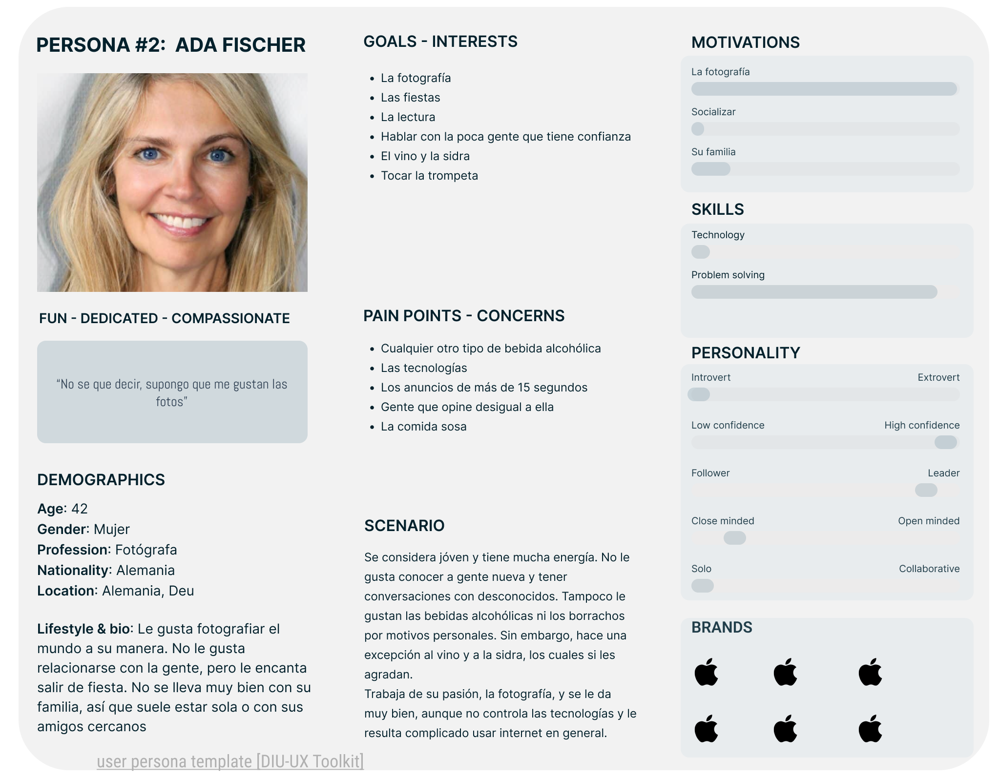

# DIU24
Prácticas Diseño Interfaces de Usuario 2023-24 (Tema: .... ) 

Grupo: DIU1_ElPatio.  Curso: 2023/24 
Updated: 13/5/2024

Proyecto: 
>>> Página web para un servidor de un videojuego

Descripción:

>>> La idea consiste en una página web dedicada a un servidor de un videojuego concreto, mediante la cual los usuarios podrán hacer cosas como, entre otros:
>>> - Participar en torneos y actividades
>>> - Hablar por el foro del servidor
>>> - Comprar en la tienda beneficios para el juego

Logotipo:
>>> 

Miembros
 * :bust_in_silhouette:   Gonzalo Alganza Luque     :octocat:     
   
----- 

# Proceso de Diseño 

## Paso 1. UX User & Desk Research & Analisis 

 **1.a User Reseach Plan**
-----

>>> https://github.com/Gonzalo845/DIUElPatio/blob/master/P1/Practica1/P1-2b%20User%20Research%20Plan%20Terminada.pdf

 1.b Competitive Analysis
-----

>>> https://github.com/Gonzalo845/DIUElPatio/blob/master/P1/Practica1/Competitive%20Analysis.pdf

 1.c Persona
-----

>>> He seleccionado a estas dos personas porque representan cada uno una parte de los usuarios que tienen mayores problemas a la hora
>>> de navegar por la web, o que tienen problemas que pueden influir en sus decisiones (Eustaquio tiene movilidad reducida, mientras que Ada
>>> no sabe español)
>>> 
>>> 

 1.d User Journey Map
----

>>> He escogido estas dos experiencias de usuario porque son más comunes de lo que puede parecer, solo que como nosotros no nos encontramos estos problemas tan
>>> a menudo (No todo el mundo tiene problemas de movilidad y muchos sabemos ingles para poder navegar por otras páginas, o español en este caso) pensamos que
>>> no suelen ser comunes.
>>> 
>>> 

 1.e Usability Review
----
>>> - Enlace al documento: https://github.com/Gonzalo845/DIUElPatio/blob/master/P1/Practica1/Usability%20review.xlsx
>>> - Valoración final (numérica): 58
>>> - Comentario sobre la valoración:  La página web tiene muchos desperfectos, sobre todo en el tema de rendimiento (tiempos de carga largos) y el desconocimiento
>>>   de si hemos interactuado con la página o no al pulsar algo (no hay respuesta hasta que carga, y como tarda en cargar, se empeora), además de que el apartado
>>>   de actividades es lioso y no deja claro en qué consiste cada actividad. Por último añadir que no hay ayuda de búsqueda avanzada para aquellos que saben lo
>>>   que quieren, además de tener que subir arriba del todo de la págian web cada vez que se quiera navegar por esta.

## Paso 2. UX Design  

 2.a Reframing / IDEACION: Feedback Capture Grid / EMpathy map 
----

>>> 
>>> 
>>>
>>> https://github.com/Gonzalo845/DIUElPatio/blob/master/P2/Practica2/Descripci%C3%B3n%20proyecto%20pr%C3%A1ctica%202.pdf

 2.b ScopeCanvas
----
>>> https://github.com/Gonzalo845/DIUElPatio/blob/master/P2/Practica2/scope_canvas_5_print_es.pdf

 2.b User Flow (task) analysis 
-----

>>> https://github.com/Gonzalo845/DIUElPatio/blob/master/P2/Practica2/Tabla%20tareas.pdf
>>> 
>>> 

 2.c IA: Sitemap + Labelling 
----

>>> 
>>> https://github.com/Gonzalo845/DIUElPatio/blob/master/P2/Practica2/Etiquetado.pdf

 2.d Wireframes
-----

>>> https://github.com/Gonzalo845/DIUElPatio/blob/master/P2/Practica2/Bocetos.pdf
>>> https://github.com/Gonzalo845/DIUElPatio/blob/master/P2/Practica2/Wireframe.pdf

## Paso 3. Mi UX-Case Study (diseño)

 3.a Moodboard
-----

>>> 
>>> 
>>> 
>>> He usado la herramienta que nos recomendaba, la página web https://www.designevo.com/
>>> 
>>> En mi caso, el logotipo si podría usarse para Twitter y otras redes sociales, así como el canal del servidor de Discord.

  3.b Landing Page
----

>>> Plantear Landing Page 

 3.c Guidelines
----

>>> Estudio de Guidelines y Patrones IU a usar 
>>> Tras documentarse, muestre las deciones tomadas sobre Patrones IU a usar para la fase siguiente de prototipado. 

  3.d Mockup
----

>>> Layout: Mockup / prototipo HTML  (que permita simular tareas con estilo de IU seleccionado)

 3.e ¿My UX-Case Study?
-----

>>> Publicar my Case Study en Github..
>>> Documente y resuma el diseño de su producto

## Paso 5. Exportación & evaluación con Eye Tracking 

Exportación a HTML/Flutter
-----

)  5.b Eye Tracking method 

>>> Indica cómo diseñas experimento y reclutas usuarios (uso de gazerecorder.com)  

Diseño del experimento 
----

>> Uso de imágenes (preferentemente) -> hay que esablecer una duración de visualización y  
>> fijar las áreas de interes (AoI) antes del diseño. Planificar qué tarea debe hacer el usuario (buscar, comprar...) 

  
>> cambiar img por tu diseño de experimento  

>> Recordar que gazerecorder es una versión de pruebas: usar sólo con 3 usuarios para generar mapa de calor (recordar que crédito > 0 para que funcione) 

Resultados y valoración 
-----

>> Cambiar por tus resultados
  

## Paso 4. Evaluación 

 4.a Caso asignado
----

>>> Breve descripción del caso asignado con enlace a  su repositorio Github

 4.b User Testing
----

>>> Seleccione 4 personas ficticias. Exprese las ideas de posibles situaciones conflictivas de esa persona en las propuestas evaluadas. Asigne dos a Caso A y 2 al caso B
 

| Usuarios | Sexo/Edad     | Ocupación   |  Exp.TIC    | Personalidad | Plataforma | TestA/B
| ------------- | -------- | ----------- | ----------- | -----------  | ---------- | ----
| User1's name  | H / 18   | Estudiante  | Media       | Introvertido | Web.       | A 
| User2's name  | H / 18   | Estudiante  | Media       | Timido       | Web        | A 
| User3's name  | M / 35   | Abogado     | Baja        | Emocional    | móvil      | B 
| User4's name  | H / 18   | Estudiante  | Media       | Racional     | Web        | B 

 4.c Cuestionario SUS
----

>>> Usaremos el **Cuestionario SUS** para valorar la satisfacción de cada usuario con el diseño (A/B) realizado. Para ello usamos la [hoja de cálculo](https://github.com/mgea/DIU19/blob/master/Cuestionario%20SUS%20DIU.xlsx) para calcular resultados sigiendo las pautas para usar la escala SUS e interpretar los resultados
http://usabilitygeek.com/how-to-use-the-system-usability-scale-sus-to-evaluate-the-usability-of-your-website/)
Para más información, consultar aquí sobre la [metodología SUS](https://cui.unige.ch/isi/icle-wiki/_media/ipm:test-suschapt.pdf)

>>> Adjuntar captura de imagen con los resultados + Valoración personal 

 4.d Usability Report
----

>> Añadir report de usabilidad para práctica B (la de los compañeros)

>>> Valoración personal 

5.) Conclusion de EVALUACION (A/B testing + usability report + eye tracking) 
----

>> recupera el usability report de tu práctica (que es el caso B de los asignados a otros grupos) 
>> con los resultados del A/B testing, de eye tracking y del usability report:
>>  comentad en 2-3 parrafos cual es la conclusion acerca de la realización de la práctica y su evaluación con esas técnicas y que habéis aprendido

## Conclusión final / Valoración de las prácticas

>>> (90-150 palabras) Opinión FINAL del proceso de desarrollo de diseño siguiendo metodología UX y valoración (positiva /negativa) de los resultados obtenidos  

